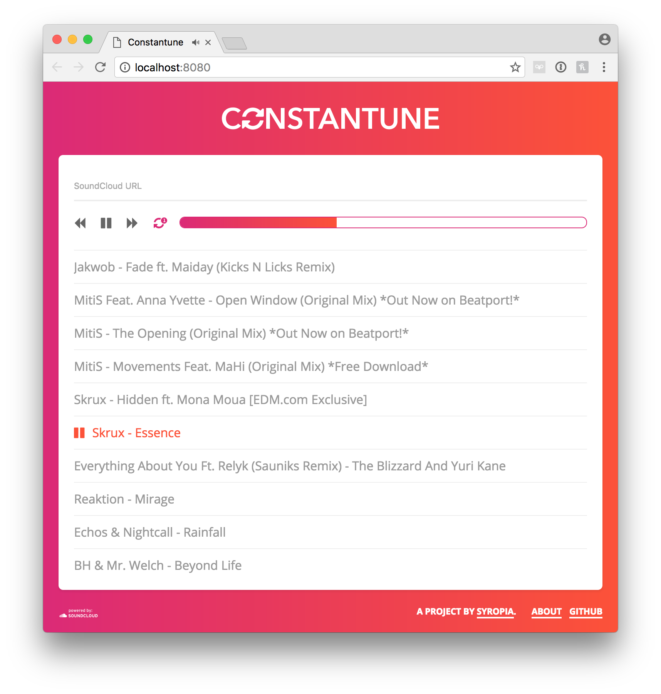

# Constantune

> A loopable SoundCloud playlist builder, built with Vue.js



## Build Setup

**Note:** If you're going to build this yourself, please use your own [SoundCloud API key](https://developers.soundcloud.com/). You set the existing key to your own in line 7 of `src/main.js`. Thanks!

``` bash
# install dependencies
npm install

# or

yarn

# serve with hot reload at localhost:8080
npm run dev

# build for production with minification
npm run build

# run all tests
npm test
```
